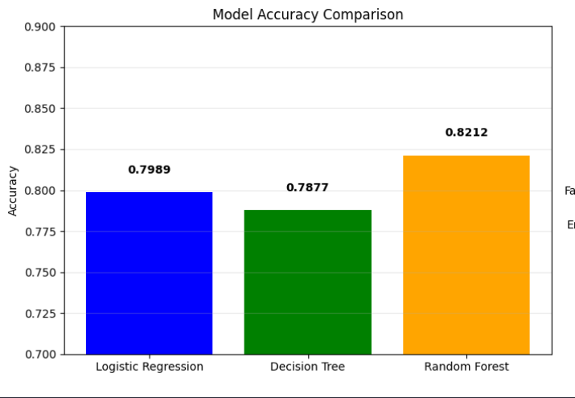
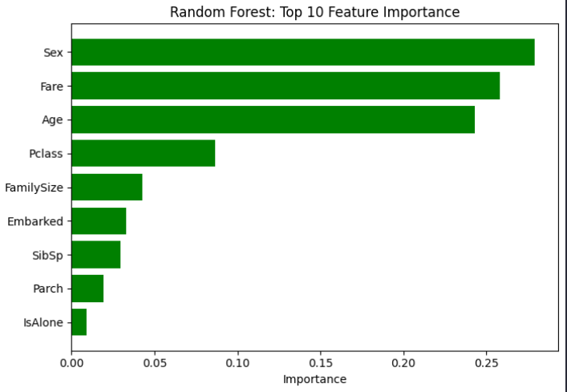
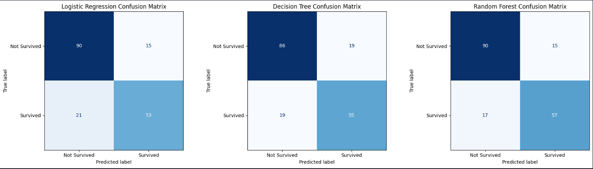
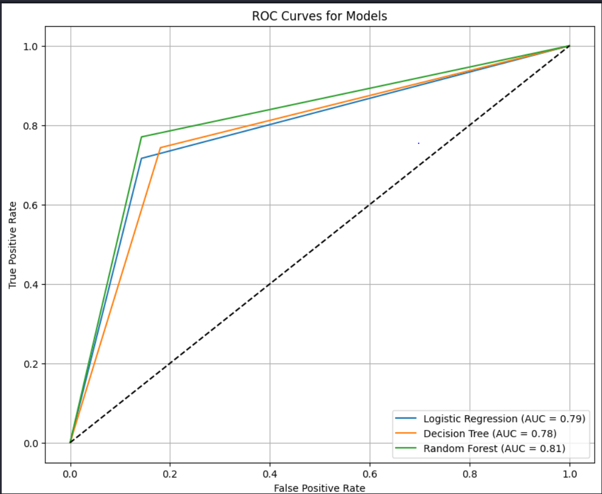
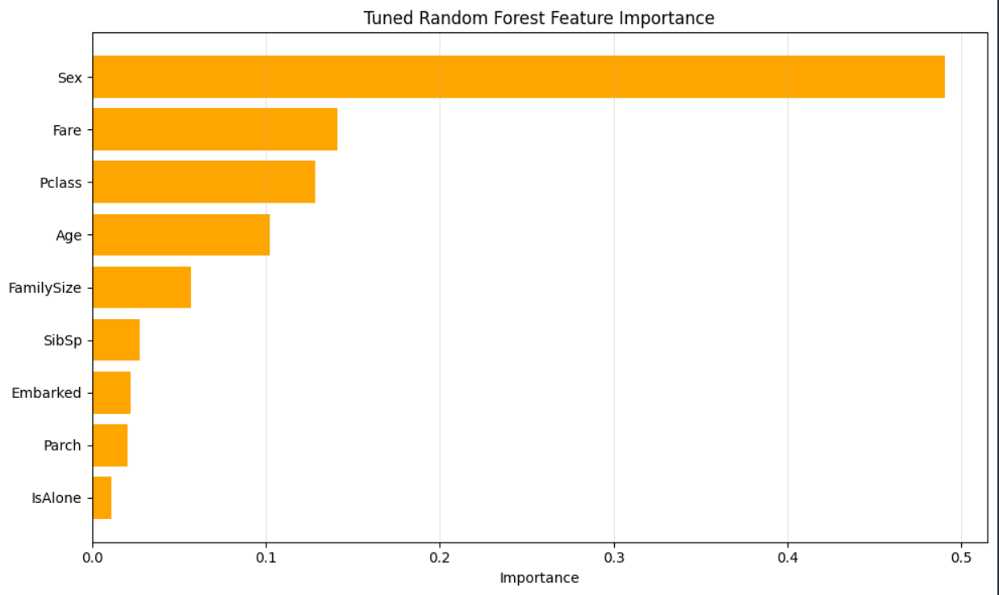

Titanic Survival Classifier 🚢
📌 Overview
This project predicts passenger survival on the Titanic using machine learning. It is based on the Kaggle Titanic dataset. The goal is to demonstrate an end‑to‑end ML workflow: preprocessing, feature engineering, model training, evaluation, visualization, and hyperparameter tuning.

📂 Workflow
## Data Preprocessing

Dropped irrelevant columns (PassengerId, Name, Ticket, Cabin)

Encoded categorical variables (Sex, Embarked)

Handled missing values in Age, Fare, and Embarked

## Feature Engineering

Added FamilySize = SibSp + Parch + 1

Added IsAlone flag (1 if passenger traveled alone)

## Model Training

Logistic Regression (baseline)

Decision Tree

Random Forest

## Evaluation

Train/validation split

Cross‑validation (5‑fold F1‑Score)

Confusion matrices

ROC curves

Precision, Recall, F1‑Score

Hyperparameter Tuning

GridSearchCV for Random Forest

Optimized parameters: n_estimators, max_depth, min_samples_split, min_samples_leaf, bootstrap

## Visualizations

Model accuracy comparison bar chart

Random Forest feature importance

Confusion matrix heatmaps

ROC curves

📊 Results

| Model | Accuracy | Precision | Recall | F1‑Score |
| --- | --- | --- | --- | --- |
| Logistic Regression | ~0.78 | ~0.75 | ~0.72 | ~0.73 |
| Decision Tree | ~0.74 | ~0.70 | ~0.68 | ~0.69 |
| Random Forest | ~0.82 | ~0.80 | ~0.78 | ~0.79 |
| Tuned Random Forest | ~0.84 | ~0.82 | ~0.80 | ~0.81 |

📸 Visuals
Model Accuracy Comparison

Random Forest Feature Importance

Confusion Matrix Heatmap

ROC Curve Comparison

Tuned Randam Forest Feature Importance
